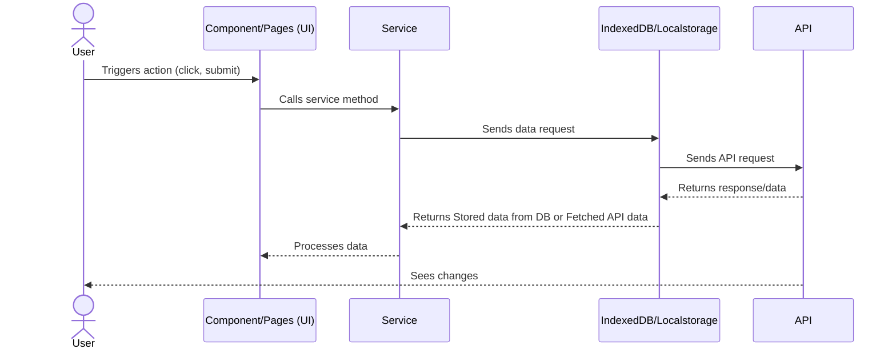

# CurrencyExchange

This project was generated using [Angular CLI](https://github.com/angular/angular-cli) version 19.2.11.

## 📋 Prerequisites

Make sure the following software is installed on your system:

- **Node.js**: v22.15.0  
- **npm**: Comes bundled with Node.js  
- **Angular CLI**: Latest version

### ✅ Install Node.js (v22.15.0)

Download and install Node.js from the official site:

🔗 [Download Node.js v22.15.0](https://nodejs.org/dist/v22.15.0/)

### ✅ Install Angular CLI
```bash
npm install -g @angular/cli
```

Verify installation:

```bash
node -v   # Expected output: v22.15.0
npm -v    # Verify npm version is installed
```

## Clone the Repository

```bash
git clone https://github.com/your-username/your-angular-app.git
cd currency-exchange
```


## Create Environments

```
1. Create environment folder under src/
 - src/environments/
    ├── environment.ts         # Development (default)
    └── environment.prod.ts 
2. Add following keys
      - production: false, (true for environment.prod.ts)
      - apiBaseUrl: '', // Follow update environment variables section to create
      - fastForexKey:  '' // Follow update environment variables section to create
```

## Update Environment variables

```text
1. Create free(7 days only) or paid account to get apiKey and apiUrl
2. Go to environments/ folder
3. Add apiBaseUrl and fastForexKey
4. Save the information
```

## Install NPM Packages

```bash
npm install
```

## Development server

To start a local development server, run:

```bash
ng serve or npm start
```

Once the server is running, open your browser and navigate to `http://localhost:4200/`. The application will automatically reload whenever you modify any of the source files.

## Code scaffolding

Angular CLI includes powerful code scaffolding tools. To generate a new component, run:

```bash
ng generate component component-name
```

For a complete list of available schematics (such as `components`, `directives`, or `pipes`), run:

```bash
ng generate --help
```

## Building

To build the project run:

```bash
ng build
```

This will compile your project and store the build artifacts in the `dist/` directory. By default, the production build optimizes your application for performance and speed.

## Running unit tests

To execute unit tests with the [Karma](https://karma-runner.github.io) test runner, use the following command:

```bash
ng test
```

## Running end-to-end tests

For end-to-end (e2e) testing, run:

```bash
ng e2e
```

# Application Architecture

### Basics

```test
1. Application uses IndexedDB and localstorage to store API fetched information to be passed to view. 
2. There is a polling mechanism involved which updated the stored information every one hour and it can be configured.
3. Incase if you goes offline, application coninute to display stored information from IndexedDB.

```

### Application Folder structure

```bash
src/
├── app/                           # Main application code
│   ├── assets/                    # Assets folder
│   ├── components/                # Child components
│   │   ├── currenices-dropdown/   # Currencies select box
│   │   ├── line-chart/            # Chat component
│   │   └── text-search/           # Text search component
│   │   └── theme-switch/          # Theme switch component
│   ├── layouts/                   # Application layout components
│   │   ├── header/                # Header component
│   │   ├── navbar/                # Navbar component
│   ├── models/                    # Application model interfaces
│   │   ├── chart-data/            # Chart data interface
│   │   ├── currency/              # Currency interface
│   │   ├── exchange-rate/         # exchange rate interface
│   │   ├── exchange-table/        # exchange table interface
│   ├── pages/                     # Application page components
│   │   ├── currency-conversion/   # Currency conversion page component
│   │   ├── exchange-rate/         # Exchange rate table page component
│   │   ├── trends/                # Trends chart page component
│   ├── services/                  # Application services
│   │   ├── api/                   # API service to fetch data
│   │   ├── connectivity/          # Checks for internet connectivity
│   │   ├── exchange/              # exchange rate service
│   │   ├── polling/               # Polling service on set interval
│   │   ├── storage/               # IndexDB and localstorage based service
│   │   ├── theme/                 # Application Theme switch service
│   ├── shared/                    # Shared
│   │   ├── chart-config/          # Chart configuration
│   ├── utils/                     # Application utilities
│   │   ├── data-utils.ts          # Reusable data utility
│   │   ├── object-to-array.ts     # Shared object to array converter
│   ├── app.routes.ts              # Main application routes
│   └── app.config.ts              # Root application config
│   └── app.component.ts           # Root application component
├── environments/                  # Environment configurations
```


###  Data Flow



### Usage Details

- Child Components
  - Currencies-dropdown
    - <app-currencies-dropdown [label]="'From Currency'" [currencies]="currencies" [selectedCurrency]="fromCurrencyControl">
        </app-currencies-dropdown>
  - Text Search
    - <app-text-search [label]="'Search'" (inputChanged)="output($event)"></app-text-search>
  - Theme Switch
    - <app-theme-switch></app-theme-switch>
- Services
  - API Service
    - Inject the service
    - Use the appropriate method eg: get(URL)
    - Then subscribe to it to receive response (subscribe({}))
  - Exchange Service
    - Inject the service
    - Use the appropriate method eg: exchangeService.getExchangeRate()
    - Then wait for the promise to resolve it
  - Storage Service
    - Inject the service
    - Use the appropriate method eg: storageService.getExchangeRate()
    - Then wait for the promise to resolve it
  - Polling Service
    - Inject the service
    - Use the appropriate method eg: pollingService.startPolling()
    - Returns an observable()
  - Connectivity Service
    - Inject the service
    - Use the appropriate method eg: connectivityService.isOnline$()
    - Returns an observable()
  - Theme Service
    - Inject the service
    - Use the appropriate method eg: themeService.toggleTheme()
    - Returns void


Angular CLI does not come with an end-to-end testing framework by default. You can choose one that suits your needs.

## Additional Resources

For more information on using the Angular CLI, including detailed command references, visit the [Angular CLI Overview and Command Reference](https://angular.dev/tools/cli) page.
